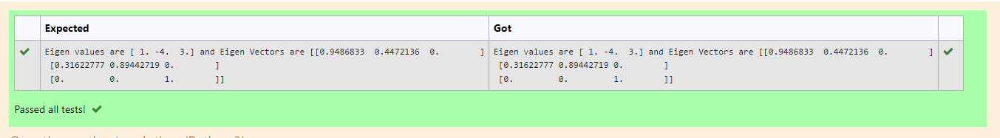

# EIGENVALUES-AND-EIGENVECTORS
## Aim:
To write a python program to find the Eigenvalues and Eigen Vectors
## Equipment’s required:
1. 	Hardware – PCs
2. 	Anaconda – Python 3.7 Installation / Moodle-Code Runner
## Algorithm:
### Step1 : 
import the numpy package

### Step 2: 
Get the input matrix.
### Step 3: 
Using the np.linalg.eig(),  we get two results (first is eigenvalue and second is eigenvector) of the given matrix.
### Step 4: 
Print the result

## Program:
```
#Program to find the eigen values and eigen vectors.
#Developed by: S.M.SYED MOKTHIYAR
#RegisterNumber:22006227
import numpy as np
A=np.array([[2,-3,0],[2,-5,0],[0,0,3]])
val,vector=np.linalg.eig(A)
print("Eigen values are",val,"and Eigen Vectors are",vector)

```
## Output:

## Result:
Thus the Eigenvalue and Eigenvector is successfully solved using python programming
